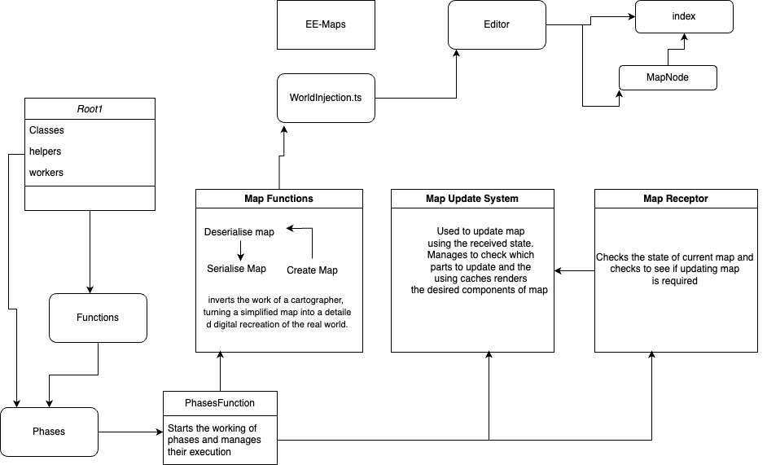

# Ethereal Engine Maps Middleware Component XRModule

The following documentation explains the working of ee-maps module:-

- _<!text_> indicates that the specific package is in use but not there in package.json of ee-maps module.
- The following is how the documentation is broken down :-
  - Packages and their dependencies used
  - Main code-setup
  - Detailed documentation of functions used in ee-maps module
  - Phases
  - Summarised Diagram

1. _Packages and their dependencies used :-_

- _@mapbox/vector-tile (version used 1.3.1 ; latest version 1.3.1 ; Active )_ :-
  This package is used to read Mapbox Vector Tiles ( parsing and decoding it) and provide extra functionalities on top of that (what are vector tiles? )

- _@turf/turf ( version used 6.5.0 ; latest version 6.5.0;active)_ :-
  Used for performing operations on geospatial data

- _pbf ( version used 3.2.1 ; latest version 3.2.1;Active)_:-
  A low-level, fast, ultra-lightweight JavaScript library for decoding and encoding protocol buffers

- _Polygon-clipping (version used 0.15.3; latest version 0.15.3;active)_ :- For applying boolean Polygon clipping operations  
  Troika-three-text(version used 0.44.0; latest version 0.47.1;active) :- For 3D text.

- _Other Dependencies_:- "earcut","@types/earcut","@types/geojson","trace-unhandled” are used as dev Dependencies …

2. _Code-Setup_:-

- # worldInjection.ts

It injects or creates the basic world component from World class taken from @etherealengine/engine/src/ecs/classes/World ( it is perhaps changed to etherealengine/packages/engine/src/ecs/classes/Engine.ts)

It then checks the node ( for checking the environment and awaits the editor if needed to create the world )

Initial things like defaultSpatialComponents, name and props of the scene are set, along with the core map functionalities ( deserialise map, serialise map, update map ) .

- # MapFunctions.ts

The major functions like deserialise map, serialise map, update map are held in this module .
It takes the core functionalities of creating, accessing and updating a component from core ee-engine as follows :-

import { addComponent, getComponent, hasComponent } from '@etherealengine/engine/src/ecs/functions/ComponentFunctions'

Serialise map :- This creates an object that holds all the info of the current map that has been made and is used by deserialise map to create a new map from this information .

Deserialise map :- It uses the MapComponent information ( stored using serialise map ) to create a map component .

Create map :- creates a whole map( 3d map with tiles ) it does by first accessing the initial coordinates of the user and then using the phases to construct the map which is then stored as a component.

- # Phases

  - _What?_

The phasers as the doc mentions is a format of code adopted to get the complex and memory-intensive tasks to be done in an organised and efficient manner

    * _How?_

We have two folders, one of the classes and another of functions, both of which are used by phases ( and also other files when needed) the functions include the functionalities that are needed for making a 3d tile upon a map.

How this works is that as soon as the engine finds a map node (from the editor MapNode.ts) while loading the world, it first gets the user’s current location, which is the initial coordinates, and then we define a radius around that region, of which we will render the 3d map. Now vector tiles data is embedded to geoJson ( for usage) and functions are run, the polygon-clipping package is used to get specific regions and have their tiles made, and we also have cache class instances that store the current state of the map, so if any updating is needed ( in the case that a user moves further in the terrain or origin is updated ) then we need to perform minimum re-working.

Also the package <!YUKA> (a js game ai),it’s polygon functionality is used to check the movement of the user and update the terrain accordingly.

- # Other files

  - #MapUpdateSystem.ts : - Used when we need to update the already create 3d map ( in case of origin change or user movement )

  - #Types.ts :- Defines the various types of various classes and interfaces used across the codebase .

  - #zipindexes.ts:- a helper generator function that is used in ExtractTileFeaturesPhase.ts

  - #util.ts :- Has some three js made utilities that are used across the codebase

  - #styles.ts :- For styling.

  - #NavMeshBuilder.ts :- Makes the NavMeshBuilder class (made using <!YUKA> )

  - #MapReceptor.ts :- Used for checking the changes in the state of user and then defining a MapAction method to help rebuild the map on state change.

  - #MapComponent.ts :- defines the MapComponentType class.

  - #getStartCoords.ts :- To get the initial coordinates of the user .

  - #constants :- some constants for overall usage

  - #GeoJSONFns.ts :- Functions to perform action on the geoJson data.
  - #Vectors.js :- The main dependencies used are called here and the vector-tile data is processed,
  - #helpers :-
    - KeyHelper:- has gethumanfriendlyfeaturekey that makes it easy for us to understand features of a tile.
    - Polyhelpers :- helps with the polygon clipping operations

3. # FUNCTIONS

_Note:- Each Feature has its own geometry ,id and properties specified in it, it’s defined in geojson package_

- _checkKey.ts_ :- It uses <!ts-match> library which now is depreciated ..
  It uses FeatureKey and TileKey , where FeatureKey type uses VectorTile interface which defines the major categories of the type of structures in a map we are currently concerned with :-

The use of this function is to validate if defined key is of the type of Feature or Tile or neither.

- _computePolygonDifference.ts_ :- Uses <!lodash> which is not depreciated but not in the package

Used for polygon operation of computing difference .

_\*\*Now function like these are self-explanatory, so I won’t go in there detail and just mention them , if they use a package that is not there or depreciated .._

- _computeTileBoundingBox.ts_

- _createCompleteObject.ts:-_ It creates as the name says the 3d object of the defined bounding circle . It uses getCachedMaterial.ts which gives us a meshLambertMaterial that is used to make a new mesh to create the overall object or the main part of our map over which particular objects like building , tree , etc will be made.

- _createFeatureLabel.ts(uses ee-engine):-_ This function as far as I understood is used to define and get a view-point of each point in the 3d space of the user ( maybe defines the view-point of the user from the current position ). Would be able to comment more after seeing it’s use .

- _createGeometry.ts :-_ It creates the basic geometry of the elements in the map and exports it’s made buffergeomtry .

- _createIntersectTestTileCircle :-_ Checks if the current tile being worked upon is in intersection or overlapping another tile ?
  It’s used along with :-

_createSurroundingTileIterator_ which iterates over each key ( or tile info ) and uses the above function to check if each iteration is unique or not.

- _createUsingGetSet:-_ This function which uses the mapStateUnwrapped type which is defined from the MapReceptor.ts file is used to create a state of the current map that has been rendered , createUsingCache uses this function to create a cache(or record of the current map state)

- _createWorkerFunction:-_ This function uses comlink that links the workers folder and it’s api to this function and makes use of worker functions:-

- _WORKERS_
  \_ _GeometryWorker.ts :-_ Uses the createGeometry function (more context needed)

      * _transformFeatureWorker.ts :-_ Runs the transformFeature.ts file’s transformFeature function which in turn uses the tranformGeometry function which uses geojson to return linestring, multilinestring and multipolygon geometry to a geojson format .

  TransformFeature gets the basic features of of a vector tile and uses turf and unitconversion functions to transform feature in the desired form as needed also added styles adn other things to it.

- _getFeaturesFromVectorTileLayer_

- _getMapboxUrl_

- _isIntersectCircleCircle_

- _tesselatePolygon:-_ To clip polygon into triangles.

- _UnitConversionFunctions_

- _unifyCachedFeatures_

- _evictLeastRecentlyUsedItem_

- _fetchVectorTile:-_ Uses the mapboxurl function to get the data about vector tile.

- _fetchUsingCache:-_ When a vector tile data has been stored as a feature vector , then if it’s data is needed it’s retrieved from the cache.

- _findSplitFeature (uses ee-engine ):-_ Used when a feature is split across multiple vector tiles, it groups them.

### \*\*\*PhaseFunction.ts (uses ee-engine):- Main file which runs the phases .

# Summarised working of the ee-maps function Module :-

This component effectively inverts the work of a cartographer, turning a simplified map into a detailed digital recreation of the real world.

The following are some of the limitations that must be considered when transforming cartographic data in real time for use in a virtual setting:
Costs in terms of both active processing time and waiting for asynchronous tasks can add up.
As soon as possible, the findings should be made public.
The user's actions should be able to alter the priority of, and dropped frames should be avoided whenever possible.

Under these conditions, complexity has the potential to spiral out of control. This motivation led to the code being organised in phases, a pattern in which a complex process is decomposed into distinct types of tasks, with a unit of code called a phase accountable for enumerating and controlling the execution of tasks of a particular type, while another unit of code decides which tasks to execute and when. Phases and tasks have a close relationship that is analogous to that of classes and their instances. Data retrieval from a remote service is an example of a phase, while data retrieval for a single tile is an example of a task within that phase. Keys are used to identify tasks; they contain only the information that is absolutely necessary for the task to be completed successfully. In this case, the key would be the specifics required to build a URL for the tile being fetched. If a phase's tasks rely on data generated by a later phase, then the latter phase's enumerated tasks will only include those that have access to the necessary data. For instance, there will only be 1 task for each tile in a phase that focuses on converting "VectorTiles" to "GeoJSON" features.

The [map update system](/packages/engine/src/map/MapUpdateSystem.ts) is triggered whenever the engine encounters a [map node](packages/editor/src/nodes/MapNode.ts) while loading a world, and it is responsible for transforming cartographic data and cascading the results through a series of caches. The data that is fetched and added to the scene is determined by a centre point (a lon/lat pair) and a radius (a value in degrees), with the former used to retrieve tiles that overlap the circle and the latter used to extract features from within those tiles that also overlap. When the focus shifts, the entire process defined by these steps must be repeated. Similar to how the local avatar's centre point is updated and the process is re-executed when the avatar's position changes by a certain amount. The caching architecture mechanically guarantees that previous executions' work is reused whenever possible. Working in tandem with the main thread (which in JavaScript is also the UI thread), worker threads are used to offload CPU-bound tasks.

# Summarised Diagram :-

Requires Mapbox API configuration to function

